# 🌌 Analemma OS

> **The Deterministic Runtime for Autonomous AI Agents**  
> *Bridging the gap between probabilistic intelligence and deterministic infrastructure.*

[](https://ai.google.dev/)
[](LICENSE)
[](https://python.org)

---

## 🔥 Why Gemini-Native?

Analemma OS is not just *using* Gemini—it's **architecturally dependent** on Gemini's unique capabilities:

| Gemini 3 Pro Capability | Analemma Integration | Competitive Advantage |
|------------------------|---------------------|----------------------|
| **1M+ Token Context** | Full execution history for self-healing | OS-level observability impossible with 200K limits |
| **Sub-second Reasoning** | Real-time kernel scheduling decisions | Syscall-level response times |
| **Native JSON Mode** | Zero-parsing kernel state serialization | No prompt engineering overhead |
| **Multimodal Reasoning** | Logs + diagrams + metrics analysis | Holistic debugging |

---

## 🎯 What is Analemma OS?

**Analemma OS** is a serverless, enterprise-grade operating system designed to orchestrate, govern, and scale autonomous AI agents. By transforming unreliable AI loops into managed, stateful, and self-healing cloud processes, Analemma provides the **"Trust Layer"** that production-ready AI demands.

```mermaid
flowchart TB
    subgraph UserSpace["🧠 USER SPACE (Agent Logic)"]
        LG[LangGraph Workflows]
        CD[Co-design Assistant]
        SR[Skill Repository]
    end
    
    subgraph KernelSpace["⚙️ KERNEL SPACE (Gemini 3 Core)"]
        SCH["🧠 Gemini Scheduler"]
        SM[State Manager]
        PS[Partition Service]
        GB[Glass-Box Callback]
    end
    
    subgraph Hardware["🔧 INFRASTRUCTURE ABSTRACTION"]
        Lambda[Compute Engine]
        SFN[State Machine]
        DB[(Storage)]
    end
    
    UserSpace --> KernelSpace
    KernelSpace --> Hardware
    
    style SCH fill:#4285F4,stroke:#333,color:#fff
```



---

## 💡 The Problem: The Trust Gap

| Problem | Impact | Analemma + Gemini Solution |
|---------|--------|---------------------------|
| **Unpredictable Loops** | $500 token spirals | Gemini loop detection + auto-termination |
| **State Volatility** | 3-hour workflows lost | S3-backed virtual memory + checkpoints |
| **Resource Throttling** | Infrastructure collapse | Reserved concurrency + backoff |
| **Black Box Reasoning** | Undebuggable agents | **Glass-Box** real-time reasoning via WebSocket |

---

## 🌐 Infrastructure-Agnostic Design

> **For Google Reviewers:** The kernel is **cloud-portable**.

| Component | Current (AWS) | GCP Equivalent (Roadmap) |
|-----------|---------------|--------------------------|
| Compute | Lambda | Cloud Run / Cloud Functions |
| Orchestration | Step Functions | Cloud Workflows |
| Storage | DynamoDB + S3 | Firestore + Cloud Storage |
| Real-time | API Gateway WS | Cloud Pub/Sub |

**The value is Gemini's reasoning—not the infrastructure wrapper.**

---

## 🏗️ Core Architecture: The 3-Layer Kernel Model

### Layer 1: User Space (Agent Logic)
- **Framework Agnostic**: Optimized for LangGraph, accepts any graph-based logic via Analemma IR
- **Co-design Interface**: Natural language-to-workflow compilation using **Gemini 3 Pro**
- **Skill Repository**: Reusable agent capabilities with version control

### Layer 2: Kernel Space (Gemini Orchestration Core)
- **Intelligent Scheduler**: Gemini-powered dynamic workflow partitioning
- **Virtual Memory Manager**: Automatic S3 offloading for payloads > 256KB
- **State Machine Controller**: Deterministic execution with checkpoint persistence

### Layer 3: Hardware Abstraction (Serverless Infrastructure)
- **Compute Layer**: Reserved concurrency protection
- **Resilience Layer**: Declarative Retry/Catch at infrastructure level
- **Distributed Execution**: Parallel processing for complex workflows

---

## 📚 Documentation

| Document | Description |
|----------|-------------|
| [**Architecture Deep-Dive**](docs/architecture.md) | Kernel design, abstraction layers, Gemini integration |
| [**API Reference**](docs/api-reference.md) | REST API, WebSocket protocol, SDK integration |
| [**Features Guide**](docs/features.md) | Co-design assistant, monitoring, Time Machine debugging |
| [**Installation Guide**](docs/installation.md) | Serverless deployment, environment setup, configuration |

---

## ⚡ Quick Start

```bash
# Clone the repository
git clone https://github.com/skwuwu/Analemma-Os.git
cd Analemma-Os/analemma-workflow-os/backend

# Install dependencies
pip install -r requirements.txt

# Configure Gemini API
export GEMINI_API_KEY="your-api-key-here"

# Deploy to AWS
sam build && sam deploy --guided
```

> 📖 See [Installation Guide](docs/installation.md) for detailed setup instructions.

---

## 🛠️ Tech Stack

| Category | Technologies |
|----------|--------------|
| **🧠 AI Core** | **Gemini 3 Pro** (Orchestration, Reasoning, Self-Healing) |
| **Runtime** | Python 3.12 |
| **Orchestration** | AWS Step Functions (→ Cloud Workflows) |
| **Compute** | AWS Lambda (→ Cloud Run) |
| **Storage** | DynamoDB, S3 (→ Firestore, Cloud Storage) |
| **Real-time** | WebSocket API |
| **Infrastructure** | AWS SAM / CloudFormation |

---

## 🔑 Key Innovations

### 🛡️ Quality Kernel (Slop Detection)
Automatic detection and prevention of LLM hallucinations and low-quality outputs at the kernel level.

**Features:**
- **SlopDetector**: Pattern-based detection of boilerplate phrases, excessive hedging, and verbose emptiness
- **EntropyAnalyzer**: Information density measurement to identify low-entropy (repetitive) content
- **QualityGate**: Multi-stage verification pipeline with optional LLM-based Stage 2 escalation
- **Real-time Interception**: Integrated directly into `llm_chat_runner` for zero-configuration protection

**Default Behavior:** Quality Kernel is **enabled by default** when available. Every LLM response is automatically analyzed.

**Disabling Quality Check:**
```json
// Method 1: Node-level config
{
    "id": "llm_node",
    "type": "llm_chat",
    "config": {
        "disable_kernel_quality_check": true
    }
}

// Method 2: Quality gate explicit disable
{
    "config": {
        "quality_gate": { "enabled": false }
    }
}

// Method 3: Workflow-level global disable
{
    "initial_state": {
        "disable_kernel_quality_check": true
    }
}
```

**Output Fields:**
| Field | Description |
|-------|-------------|
| `_kernel_quality_check.slop_score` | 0.0 (clean) to 1.0 (pure slop) |
| `_kernel_quality_check.is_slop` | Boolean slop detection result |
| `_kernel_quality_check.action` | `PASS`, `ESCALATE_STAGE2`, `DISTILL`, or `REJECT` |
| `_kernel_action` | Quick reference to the action taken |

### 🎯 Mission Simulator (Chaos Engineering)
8+ failure scenarios: network latency, LLM hallucinations, rate limiting, cold starts.
- **98%+ success rate** under adversarial conditions

### ⏱️ Time Machine
Every step persisted. Resume from exact failure point with **zero data loss**.

### 🔄 Gemini Self-Healing
Full execution context analysis → automatic recovery path injection.

### 👁️ Glass-Box Observability
Real-time WebSocket streaming of AI reasoning with `trace_id` correlation.

### 🤝 Human-in-the-Loop (HITP)
Physical pause points for human approval, integrated with Task Tokens.

---

## 📄 License

This project is licensed under the **Business Source License 1.1 (BSL 1.1)**.

- **Non-Production Use**: Free for development, testing, and personal projects
- **Production Use**: Contact for commercial licensing
- **Change Date**: Converts to Apache 2.0 on 2029-01-14

See [LICENSE](LICENSE) for full terms.

---

## 🏆 Google Gemini API Developer Competition 2026

This is the **official hackathon submission**. The architecture fundamentally depends on Gemini's unique capabilities—this couldn't be built with any other model.

---

<div align="center">
  <sub>Built with ❤️ for the Gemini ecosystem</sub>
</div>
